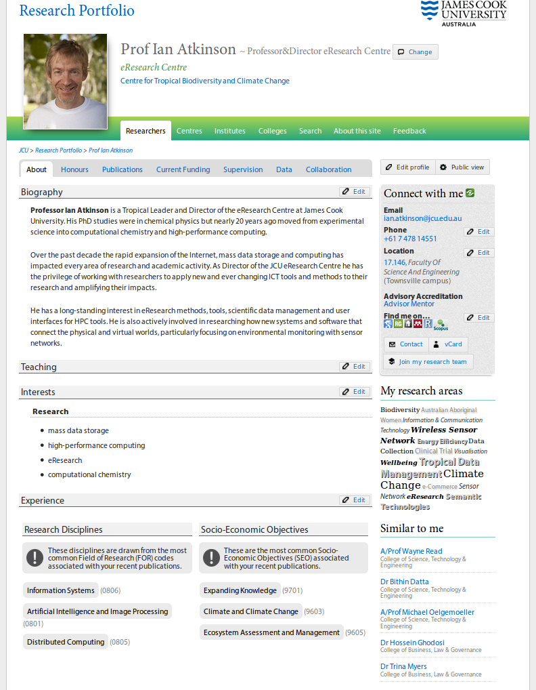
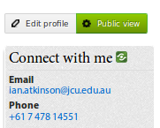
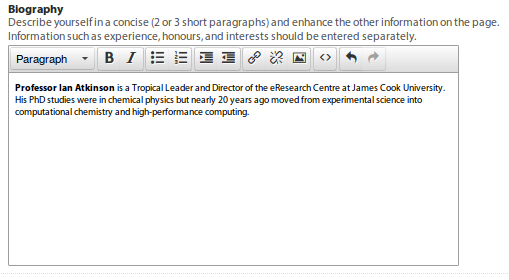
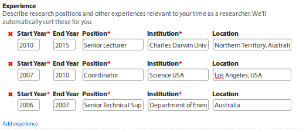
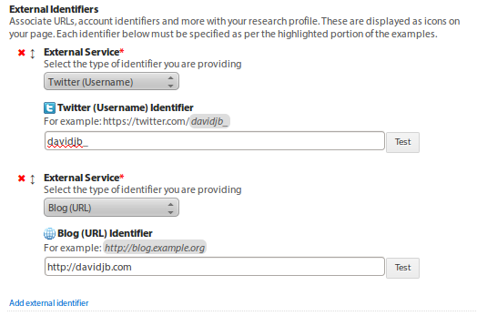
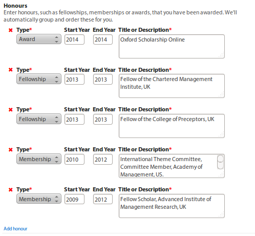
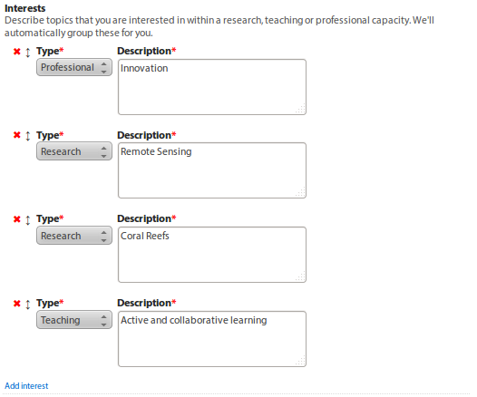

.. _edit-profile:

Editing your profile
====================

Let's take a look through how to get started editing a profile.

In general, there are two key types of information on the |project-name|:

* **Self-contributed information**: particulars that you can update online any
  time via your profile page, such as biography, interests and experience.
  Changes take effect immediately and are visible instantly.

  See :ref:`self-contributed-information` for more details on how to edit this
  data.

* **Institutional information**: data that other departments are
  responsible for managing, such as publications, research grants, and
  personal information.  |weekly-update|

  You'll need to contact the :ref:`relevant department
  <institutional-information>` to update this data. 

Who can edit profiles?
----------------------

Individuals can edit their own profiles online, and anyone who holds the
Research Portfolio Officer organisational role may edit profiles within their
College or Discipline. To determine who may edit profiles in your department,
see `role emails
<https://secure.jcu.edu.au/app/roleemails/index.cfm?showmember=ResearchPortfolioOfficer>`__.

Editor's view
-------------

If you're logged in and viewing your own profile or a profile that you can
otherwise edit, you'll notice the page will show all potential data tabs and a
number of *Edit* buttons on the page.  This shows a complete view of what can
be included and how to update details or who to contact.

Viewing your updated profile
----------------------------

.. note::

   If your profile is hidden, it will not be listed anywhere on the site.
   Anyone without edit access will not be able to see or access your profile.

If you've just updated settings or information on your profile, you'll want to
see how it looks to the world.

#. If still editing your profile, click the ``Cancel editing`` button on the
   *Edit profile* page.

#. Click the ``Public view`` button to toggle how your profile appears. Any
   empty tabs or sections will disappear.

#. Click the ``Public view`` button again to toggle the page back again.

.. _self-contributed-information:

Changing self-contributed information
-------------------------------------

All these tasks will require you to first :ref:`login <logging-in>` and
:ref:`access your profile <access-a-profile>` page.  If you are a Research
Portfolio Officer and editing others' pages, you'll need login as yourself,
but you'll be accessing the researchers' pages.

Adding or changing photos
~~~~~~~~~~~~~~~~~~~~~~~~~

.. note::

   Try to select an image with eye contact that helps identify you!  The
   University style guide sets out that our imagery is full colour, bright and
   high in contrast with saturated colours, so select an image like this.

To update your existing photo or change the initial generic photo:

#. Login and access your profile page.

#. Click the default photo on the profile page.  You'll notice an ``Edit
   Photo`` label appear when doing this.

#. Use the pop-up window that appears to manage your photo.

#. Choose a photo to upload, and click the ``Upload`` button.

#. Click and drag on the photo that is displayed to crop to suitable size.

   .. image:: ./images/photo-cropping.png
      :width: 40%

#. When done, click the ``Crop`` button at the bottom of the page.  If you
   make a mistake, you can click ``Revert to original`` to go back to the
   original image.

#. Close the pop-up window to see the results.

.. _profile-settings:

Changing your profile settings and data
~~~~~~~~~~~~~~~~~~~~~~~~~~~~~~~~~~~~~~~

.. note::

   Keep in mind that any changes to a profile will take time to be reflected
   in search engines. This may be several days or longer.

Aside from data sourced automatically, a profile page includes many types of
information that you can update live online. To do so:

#. Login and access your profile page.
#. Click the ``Edit profile`` button.
#. Step through each section of the form and add details or change settings.
#. Click ``Save changes`` to update your profile.  Changes will be applied
   immediately.

Types of information you can self-contribute includes:

General settings
~~~~~~~~~~~~~~~~

These are general configuration options that control how your profile is
displayed on the site.

Hide my profile
    Temporarily hide your profile from being public.
Hide my title
    Hide your salutation/prefix from profile pages and listings.
Hide Altmetric badges
    Hide the colourful `Altmetric <https://altmetric.com>`_ badges from publications.

Biography
~~~~~~~~~

Your self-authored description of yourself, your research and other relevant
details. The editor allows you to format text in multiple ways, insert
hyperlinks and change the paragraph styles easily.  The editor displays the
results before you save the changes.

You can copy and paste from another document or your homepage, but please keep
the biography concise - two or three short paragraphs - so it doesn't
overshadow the other information on the page.  Ensure you break out your
`experience`_, `honours`_ and `interests`_ into the appropriate sections as
this will improve your search rankings.

You are able to add links, bulleted or numbered lists and images into your
biography but these should be used carefully and sparingly. Remember that this
is the world's view to you and your research.

Experience
~~~~~~~~~~

Describe positions and experience relevant to your work by adding them, one at
a time.  For a current position, leave the ``End Year`` field empty.

.. note:: Experience is shown in reverse chronological order when displayed on
   a profile page.

External identifiers
~~~~~~~~~~~~~~~~~~~~

These are links to your website, web pages or profiles on systems external to
the University that help to bridge your digital identity. These can be
publisher or professional identities such as ORCID, Scopus or Google Scholar
and can also be social media sites such as LinkedIn and Twitter.  When you
enter and save an identifier, the corresponding icon will appear on the
*Connect with me* panel on your profile.

When adding a new identifier, the grey highlighted section of the example
(sometimes the example is the entire entry) shows the part of the URL or
identifier required. You can use the ``Test`` button to confirm your profile
loads in the pop-up window that appears.

If you're editing your profile for the first time, you'll likely find some of
these identifiers have been added automatically.

.. note:: Identifiers are shown in the order you list them when displayed on
   a profile page.

Honours
~~~~~~~

Highlight fellowships, memberships and awards that you've received or are associated with by adding *Honours* to your profile.

.. note:: Honours are grouped by type, and shown in reverse chronological
   order when displayed on a profile page.

Interests
~~~~~~~~~

Describe topics you are interested in within a research, teaching or
professional capacity. All information is searchable across the site, and can
improve your discoverability.

.. note:: Interests are grouped by type, and shown in the order you list them
   when displayed on a profile page.

Locations
~~~~~~~~~

.. image:: ./images/locations.png

Add rooms or lab locations to your profile. Adding a location automatically
links to interactive maps to display your building.

.. note:: Room locations are only available for Townsville, Cairns, and
   Singapore campuses.

An auto-completion list will be displayed when entering a building number.
Use this to select your room from the menu. You can add a second room, such
as if you have an office on a different campus or lab in a different area.

.. note:: Locations are shown in the order you list them when displayed on
   a profile page.

.. _institutional-information:

Updating institutional information
----------------------------------

Beyond the self-contributed information mentioned :ref:`above
<self-contributed-information>`, the |project-name| uses information from the
following James Cook University systems:

* Human Resources Information Management System (HRIMS)
* Research Information Management System (RIMS)
* Publication Repository (ResearchOnline\@JCU)
* Student Information System (Student One)
* Research Data Catalogue (ReDBox)
* Teaching Responsibilities Database (TRDB)
* Telephone Switchboard

As the Research Portfolio is acts as a display of information from these other
systems, the original department managing the data is responsible should it
need correction.  Any changes will automatically flow through to the
|project-name|; see :ref:`recent changes <recent-changes>`.

.. note::

   Before contacting the administrator of any data source please check the
   criteria and notes listed to ensure that the data in question is indeed
   incorrect and not just excluded from display.

HRIMS (Human Resources)
~~~~~~~~~~~~~~~~~~~~~~~

* Title
* Name
* Position title
* Organisational units
* Campus

.. note::
   The basic information about each researcher displayed in the titles,
   headings and *Connect with me* panel.

For changes, contact your College Manager or Supervisor - they will know the
correct procedure to make the change or can contact Human Resources if
required.  For the data items listed here to be corrected or changed,
verification will be required, usually with supporting documentation.  For
example, a copy of your qualifications would be required to change your title.
Your email address can be changed after a change of name is confirmed by Human
Resources.

|weekly-update|

JCU Identity Management (ICT)
~~~~~~~~~~~~~~~~~~~~~~~~~~~~~

* Email address

For changes, contact the `IT Helpdesk`_. Correct information must already be
in the HRIMS system. For example, if you require your preferred name to be
used in your email address rather than your given name, then the preferred
name must already be in your Human Resources record.

|weekly-update|

Telephone Switchboard
~~~~~~~~~~~~~~~~~~~~~

* Phone numbers

.. note::
   Displayed in the *Connect with me* panel, if available.

For changes, contact the `JCU Switchboard`_. |weekly-update|

Research Information Management System (RIMS; Research Services)
~~~~~~~~~~~~~~~~~~~~~~~~~~~~~~~~~~~~~~~~~~~~~~~~~~~~~~~~~~~~~~~~

* FOR codes
* SEO codes
* Keywords
* Collaborations
* Funding details
* Groups

.. note::

   RIMS combines data associated with publications and grants/contracts, for
   the last five years, to produce:

   * Top Research Disciplines
   * Top Socio-Economic Objectives (SEO)
   * A set of most frequently used keywords for research activities
   * List of current funding. Includes those granted but not yet started;
     currently active; or completed in the last year.
   * Collaboration world map, by country and state for Australia, USA, and
     Canada. Collaborations are per institution.

   Codes, keywords and collaborations are based on data entered into
   ResearchOnline\@JCU for outputs and into the RIMS Grants database for
   inputs over the last 5 years.  Submitting publications and grants will
   automatically update the codes, keywords and collaborations displayed.

For changes to listed funding details, contact the `IT Helpdesk`_ and request
the job be assigned to the Research Information team within Research Services.
|weekly-update|

ResearchOnline\@JCU (JCU Library)
~~~~~~~~~~~~~~~~~~~~~~~~~~~~~~~~~

* Publications

.. note::

   Publications are grouped by type, and the 12 most recent publications are
   shown.  HERDC eligible outputs are favoured over others, even if they are
   older.  As such, if you have more than 12 recent publications, it is likely
   some more recent publications may not be shown.  A visitor to a
   |project-name| page can always load the full list of publications by
   following the relevant link

To submit publications, go to `ResearchOnline@JCU`_. For importing your past
outputs via ResearcherID and for changes to existing publications, output
references, `contact <http://researchonline.jcu.edu.au/contact.html>`_ the
ResearchOnline\@JCU team.

The following summarises the types of publications that are considered
HERC-eligible:

=======================    ========================================   ========
Publication Type           Description                                Category
=======================    ========================================   ========
Book                       Authored - research                        A1
Book Chapter               Chapter in A1 book                         B1
Journal Article            Refereed article in a scholarly journal    C1
Conference Publication     Full written paper - refereed              E1
=======================    ========================================   ========

If there is a discrepancy, contact `ResearchOnline@JCU`_ staff to have the
publication checked.

|weekly-update|

Student Management System, StudentOne (GRS)
~~~~~~~~~~~~~~~~~~~~~~~~~~~~~~~~~~~~~~~~~~~

* Supervision records

.. note::

   Supervision activities marked as currently active or completed within the
   last five years. For completed students, the thesis title will link to
   their ResearchOnline\@JCU publication.

For changes, contact the `Graduate Research School`_. |weekly-update|

ReDBox (Research Data Catalogue)
~~~~~~~~~~~~~~~~~~~~~~~~~~~~~~~~

* Dataset records

.. note::

   Displays the 10 most recently entered metadata records.

For updates or changes, manage this information directly through the `ReDBox`_
application. For more information, contact the `IT Helpdesk`_ and request the
job be assigned to the Research Data team within the eResearch Centre.

|weekly-update|

Teaching Responsibilities Database (TRDB)
~~~~~~~~~~~~~~~~~~~~~~~~~~~~~~~~~~~~~~~~~

* Teaching commitments

.. note::

   Displays only those subjects for which the researcher has **Lecturer**
   responsibilities in the current year. Subjects with the word **Honours** in
   the title are excluded.

For changes, contact the Teaching Role Administrator for your College or
Division. To identify who to contact, use the `role emails
<https://secure.jcu.edu.au/app/roleemails/index.cfm?showmember=TeachingRolesAdmin>`__
page.

.. _IT Helpdesk: http://www.jcu.edu.au/helpdesk
.. _JCU Switchboard: http://www.jcu.edu.au/contacts/campus/JCUPRD_053790.html
.. _ResearchOnline@JCU: https://researchonline.jcu.edu.au/
.. _Graduate Research School: http://www.jcu.edu.au/grs
.. _ReDBox: http://research.jcu.edu.au/researchdata/
.. |weekly-update| replace:: Updates will be automatically reflected on
   Portfolio pages on the weekend following a change.
