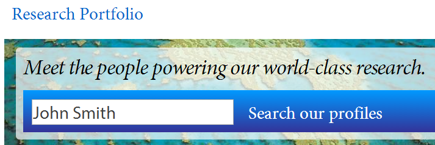

Features
========

This is an explanation of the different features available on the
|project-name|.  If you don't feel like reading, just go exploring at
https://jcu.me!

What's new?
-----------

See the `Features <https://jcu.me/features>`_ page for the latest updates and
changes.

Short web address (URL)
-----------------------

It's easy to remember: `jcu.me`_!

Anything you type after ``jcu.me`` automatically points visitors at
``https://research.jcu.edu.au/portfolio``, being the full site URL.  So, the
following are possible:

* `jcu.me/collaboration <https://jcu.me/collaboration>`_ links to the
  worldwide collaboration map
* `jcu.me/search/turtle <https://jcu.me/search/turtle>`_ links to the
  search for turtles
* ...and any other page works in the same way!

This means that individual profiles get a `jcu.me`_ address. For example,
Professor Ian Atkinson can be found at `https://jcu.me/ian.atkinson
<https://jcu.me/ian.atkinson>`_.  It's the first part of the person's email
address.  This makes for a simple, memorable link for a business card or email
signature.

.. _search:

Full-text search
----------------

This feature executes an intelligent search on research disciplines,
socio-economic objectives, keywords, campus, names, biography or interests,
including synonyms and partial word searches.

Use the search box on the home page to search and you can also use the
``Search`` link to jump to a dedicated search page from anywhere.

Find an advisor
---------------

Just use the link on the home page to start a search for an advisor for a
research project.  This predefined search lists only those staff on the
research advisor register. Adding words to the search will only show results
for registered advisors.

Interactive data
----------------

The |project-name| features interactive collaboration maps which show links
across the world (built from publication and grant listings).  Maps can show
collaborations for a specific Division or College, or a Research Centre or
Institute.

The word clouds linked from the `jcu.me`_ homepage show different aspects of
data, including fields of expertise for the University and research keywords
that highlight the areas of excellence for the University's research.

Centres, Institutes and Colleges
--------------------------------

There are links at the top of every page that access listings of the James
Cook University Centres, Institutions, Collages and their respective members.
These pages are automatically updated from the relevant data stores.

Profile pages
-------------

Dynamic data
~~~~~~~~~~~~

We automatically pull and aggregate information for many different data
sources across the University for simple display in one place.

Read more about the :ref:`institutional-information`.

Researcher-contributed details
~~~~~~~~~~~~~~~~~~~~~~~~~~~~~~

Researchers can also self-contribute many different pieces of information
about themselves to enhance their Research Portfolio page.

For details on how to update information, see
:ref:`self-contributed-information`.

Similar to me
~~~~~~~~~~~~~

Each profile will show a *Similar to me* panel which helps visitors build
connections between researchers.  These associations are built using all
information associated with a profile and dynamically calculated on similar
research interests, keywords, research disciplines, socio-economic objectives,
and co-authored papers.

Altmetric badges
~~~~~~~~~~~~~~~~

Altmetric badges are the colourful *donut* indicators against publications on
profile pages.  They provide helpful indications as to the social impact that
research publications have, and automatically update to include counts of news
articles, blogs, and various social network posts that feature the
publication.

If a publication is missing an Altmetric badge, no count has been detected.
Mentioning publications on Twitter, Facebook or other social media boosts
exposure.  Ensure that any news articles and blog posts include either a link
to the publication, or mention its DOI (Digital Object Identifier).

Altmetric badges can be disabled on a per-profile basis; see
:ref:`profile-settings`.

.. _jcu.me: https://jcu.me
