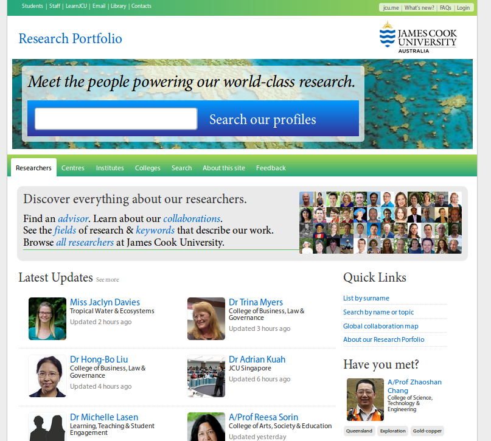

Introduction to the |project-name|
==================================

**The Research Portfolio is the flagship web application which promotes and
facilitates research activities within James Cook University.**

Each :ref:`active researcher <active-researcher>` in the University has a
profile within the Research Portfolio, displayed alongside tools for exploring
the University's research efforts.

Each researcher's profile highlights many types of information, ranging from
publications to grants, supervision, collaboration and everything in-between.
Researchers and nominated college or divisional staff have access to
live-update much of this information; there is no limit to how frequently
information can be updated.

This documentation covers various aspects of the Research Portfolio,
including features, profile creation and editing, and a technical break-down
of automatic data sources.  In addition, this documentation aims to serve as
a reference for Research Portfolio officers when they are updating profile
pages in their division or college.

Got feedback?
-------------

If you've got feedback about the Research Portfolio or this documentation,
please get in touch by contacting the `IT Helpdesk`_. We'll get back to you as
soon as possible.

Even if you're not a JCU staff member or researcher, you can still send an
email to the `IT Helpdesk`_ to send your feedback or suggestions.

.. _IT Helpdesk: http://www.jcu.edu.au/helpdesk
